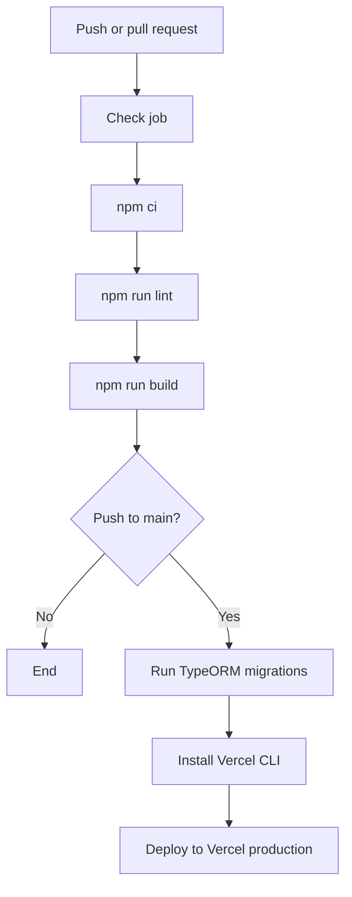
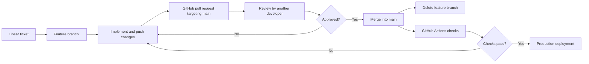
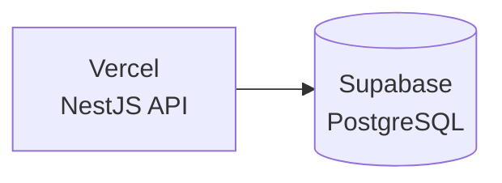

# Deployment Pipeline

This repository has two deployment paths:

- **Local deployment:** Docker Compose runs PostgreSQL, while the NestJS API runs from the repository with npm.
- **Production deployment:** GitHub Actions validates the repository, runs TypeORM migrations against the production PostgreSQL database, and deploys the NestJS API to Vercel. Supabase can provide that production PostgreSQL database.

## Pipeline Overview



The workflow is defined in `.github/workflows/main.yaml`.

## Branching Strategy

Development follows a short-lived feature branch workflow tied to Linear tickets:

1. Create a feature branch from the latest `main` branch for the assigned Linear ticket.
2. Name the branch using the Linear ticket code in the format `<ticket-code>`. The angle brackets are documentation placeholders and must not be included in the actual branch name. For example, use `ABC-123`, not `<ABC-123>`.
3. Commit and push the work to the feature branch.
4. Open a GitHub pull request targeting `main`. The pull request title must use the format `<Linear Ticket ID> - <Linear Ticket Title>`, for example `ABC-123 - Add user search`. The angle brackets are placeholders and must not be included in the actual title.
5. Write a pull request body that details the new changes so reviewers can understand the implementation and its scope.
6. A different developer reviews the pull request and approves it.
7. Merge the approved pull request into `main`.
8. Delete the feature branch after the pull request is merged. If GitHub's automatic head-branch deletion is enabled, confirm that GitHub removed it; otherwise, delete it manually.
9. The push to `main` runs the checks and, if they pass, triggers the production deployment.



All feature branch pushes and pull request events run the workflow's check job. Only a push to `main` can run the production deployment job; a pull request does not deploy to production.

## Local Deployment

Local deployment uses the services defined in `compose.yaml`. Starting the Compose project brings up all dependent infrastructure needed for local development; the Compose file does not build or run the NestJS API itself.

### Prerequisites

- Docker with Compose support
- Node.js and npm
- A local `.env` file or exported variables for `POSTGRESQL_VERSION`, `POSTGRESQL_PORT`, `POSTGRESQL_USER`, `POSTGRESQL_PASSWORD`, and `POSTGRESQL_DATABASE`

The same `POSTGRESQL_*` variables configure both the PostgreSQL container and the application. Example local values are:

```dotenv
POSTGRESQL_VERSION=17
POSTGRESQL_PORT=5432
POSTGRESQL_HOST=localhost
POSTGRESQL_USER=postgres
POSTGRESQL_PASSWORD=admin
POSTGRESQL_DATABASE=codev_osrs_db
```

Do not commit real credentials. The defaults in `src/config/typeorm.config.ts` are suitable only for local development.

### Start the Database and API

Install dependencies, start PostgreSQL, apply migrations, and start the API:

```bash
npm install
docker compose up -d
npm run migration:run
npm run start:dev
```

`docker compose up -d` starts every service defined in `compose.yaml`, so newly added local dependencies are included automatically.

The API listens on `http://localhost:3000` unless `PORT` is set. The local database can be stopped with:

```bash
docker compose down
```

The named `postgresql` volume preserves database data between container restarts. To remove the data as well:

```bash
docker compose down -v
```

### Local Checks

Run the same checks available in the repository before opening a pull request:

```bash
npm run lint
npm test
npm run test:e2e
npm run build
```

The e2e tests import `AppModule`, so they may require a reachable PostgreSQL instance and matching environment variables.

## Production Deployment

Production deployment uses GitHub Actions, Vercel, and a separately hosted PostgreSQL database such as Supabase. The workflow is defined in `.github/workflows/main.yaml`.

The production API is available at [https://codev-osrs-backend.vercel.app](https://codev-osrs-backend.vercel.app).

### Production Architecture

GitHub Actions is the deployment coordinator. Vercel hosts the production NestJS API, and Supabase provides the production PostgreSQL database. The deployment workflow runs migrations against Supabase before deploying the API to Vercel. At runtime, the Vercel API connects to Supabase using the production `POSTGRESQL_*` environment variables configured in Vercel.



The production request path is `API clients -> Vercel -> NestJS API -> Supabase PostgreSQL`. The deployment path is `main push -> GitHub Actions checks -> TypeORM migrations -> Vercel production deployment`.

### Trigger and Promotion Rules

- A push to any branch starts the `check` job.
- Opening, synchronizing, or reopening a pull request starts the `check` job.
- The `deploy` job runs only for a push to `main`.
- Production deployment waits for the `check` job to complete successfully.
- The workflow does not currently define a staging deployment or a manual approval gate.

### Check Job

The check job runs on `ubuntu-latest` with Node.js 24:

1. Check out the repository.
2. Install dependencies with `npm ci`.
3. Run Oxlint with `npm run lint`.
4. Compile the application with `npm run build`.

The workflow contains a commented-out test step. Unit and e2e tests are available locally, but they are not currently required by GitHub Actions:

```bash
npm test
npm run test:e2e
```

### Production Deployment Job

The production job repeats checkout, Node.js setup, and `npm ci`, then performs these operations in order:

1. Run pending TypeORM migrations:

   ```bash
   npm run migration:run
   ```

2. Install the Vercel CLI:

   ```bash
   npm install --global vercel@latest
   ```

3. Deploy the application to Vercel:

   ```bash
   vercel deploy --prod --yes --token="$VERCEL_TOKEN"
   ```

Migrations run before the Vercel deployment. A failed migration stops the job and prevents the application deployment step from running.

### Required GitHub Actions Secrets

The workflow passes the following repository or organization secrets to the jobs:

### Vercel

- `VERCEL_ORG_ID`
- `VERCEL_PROJECT_ID`
- `VERCEL_TOKEN`

`VERCEL_TOKEN` authenticates the CLI deployment. The organization and project IDs are exposed to the job environment for Vercel project configuration, although the current deploy command relies primarily on the token and repository-linked project settings.

### PostgreSQL

- `POSTGRESQL_HOST`
- `POSTGRESQL_PORT`
- `POSTGRESQL_USER`
- `POSTGRESQL_PASSWORD`
- `POSTGRESQL_DATABASE`

These values are consumed by `src/config/typeorm.config.ts` through `dotenv` and `process.env`. The current workflow passes them to the migration command, so the migration runner requires the production database credentials in GitHub Actions secrets.

### Supabase PostgreSQL

Supabase can host the production PostgreSQL database. The attached deployment summary recommends Supabase's pooled connection, commonly using port `6543` and SSL. This repository currently does **not** parse a `DATABASE_URL`; it requires the individual `POSTGRESQL_*` variables listed above. Configure those values from the Supabase connection details, including the correct host, port, username, password, and database name.

If the application is later changed to use a single `DATABASE_URL`, update both the TypeORM configuration and the migration workflow together. Do not add a `DATABASE_URL` to the deployment guide as though the current implementation already supports it.

### Vercel Runtime Configuration

The Vercel project must have the production database variables available to the deployed application:

- `POSTGRESQL_HOST`
- `POSTGRESQL_PORT`
- `POSTGRESQL_USER`
- `POSTGRESQL_PASSWORD`
- `POSTGRESQL_DATABASE`
- `PORT` when a non-default port is required

`VERCEL_TOKEN`, `VERCEL_ORG_ID`, and `VERCEL_PROJECT_ID` remain GitHub Actions deployment credentials/configuration; they are not application runtime secrets. Configure any future application secrets, such as JWT keys or API keys, in Vercel Production environment variables.

If the Vercel project is connected directly to GitHub, disable Vercel automatic Git deployments so GitHub Actions remains the single production deployment path. The repository does not currently contain a `vercel.json` implementing this setting, so it must be configured in Vercel or added separately if that behavior is required.

### Application Runtime

The NestJS bootstrap in `src/main.ts`:

- Creates the application from `AppModule`.
- Enables the global `ValidationPipe`.
- Listens on `process.env.PORT`, defaulting to port `3000`.

The production start command for a built deployment is:

```bash
npm run start:prod
```

The application uses PostgreSQL through TypeORM. Database schema synchronization is disabled (`synchronize: false`), and migrations are not automatically run by application startup (`migrationsRun: false`). This makes the explicit migration step in the GitHub Actions workflow required for schema changes.

## Operational Notes

- Run migrations against the intended production database, not a local or staging database, by validating the GitHub secret values before merging a migration.
- Because migrations execute before the Vercel deployment, prefer backward-compatible schema changes when an old application version may still be serving traffic.
- The workflow does not run tests, build a Docker image, or deploy the PostgreSQL container.
- The repository includes an `npm run deploy` script for `nest deploy`, but the GitHub Actions production path uses the Vercel CLI directly instead.
- `@nestjs/observe` is configured in `src/app.module.ts`; production observability credentials must be configured before relying on telemetry. The source currently contains placeholder values for the Observe app key and secret.
