# Frontend Integration Guide

This guide maps the screens in [`docs/screens/`](docs/screens/) to the current API. Swagger at the API root documents the full DTO schemas and response examples. If this guide and Swagger differ, use the live API contract and update this guide.

## Connection And Session

- Local base URL: `http://localhost:3000` (or the configured `PORT`); routes have no `/api` prefix. Swagger UI is at `/`.
- Production base URL: `https://codev-osrs-backend.vercel.app/` (routes have no `/api` prefix).
- Set backend `CORS_ORIGINS` to the exact frontend origin. Credentialed browser requests require `credentials: 'include'`.
- Authentication is an HTTP-only `session` cookie. Do not read or persist a token in frontend storage. The cookie lasts eight hours; production sets `Secure` and `SameSite=Lax`. Host the frontend and API on the same site for cookie compatibility.
- Send JSON bodies with `Content-Type: application/json`.
- `POST /auth/google` accepts `{ "credential": "<Google ID token>" }`. It provisions/refreshes the account, sets the cookie, and returns the current user. Role is `admin` or `employee`; select the frontend view using this field.
- `GET /auth/me` restores the current user on app startup. `POST /auth/logout` clears the cookie. Both are safe to call with `credentials: 'include'`.
- A welcome email is sent only when Google sign-in creates a new account. The backend, not the frontend, sends request lifecycle emails.

Use this helper in the examples below. It always includes the session cookie and serializes JSON bodies; set `API_BASE_URL` to localhost or the production URL above.

```ts
type SessionUser = {
  id: number;
  role: 'admin' | 'employee';
  location: string;
};

type ApiProblem = {
  title?: string;
  status?: number;
  detail?: string;
  errors?: Array<{ detail: string; pointer: string }>;
};

class ApiError extends Error {
  constructor(
    readonly status: number,
    readonly problem: ApiProblem,
  ) {
    super(problem.detail ?? problem.title ?? `API request failed (${status})`);
  }
}

async function apiFetch<T = unknown>(
  path: string,
  options: Omit<RequestInit, 'body' | 'credentials'> & { body?: unknown } = {},
): Promise<T> {
  const { body, ...init } = options;
  const headers = new Headers(init.headers);
  if (body !== undefined) headers.set('Content-Type', 'application/json');

  const response = await fetch(`${API_BASE_URL}${path}`, {
    ...init,
    headers,
    credentials: 'include',
    ...(body === undefined ? {} : { body: JSON.stringify(body) }),
  });
  const payload = await response.json();
  if (!response.ok) throw new ApiError(response.status, payload);
  return payload as T;
}
```

## API Map

| Method | Route | Access | Use |
| --- | --- | --- | --- |
| `POST` | `/auth/google` | Public | Google sign-in and session creation |
| `POST` | `/auth/logout` | Public | Clear session cookie |
| `GET` | `/auth/me` | Signed in | Restore current user/profile |
| `GET` | `/assets` | Employee, admin | Paginated asset catalog and available counts |
| `GET` | `/assets/:id` | Employee, admin | Asset details/specifications |
| `POST` | `/assets` | Admin | Create catalog asset |
| `PATCH` | `/assets/:id` | Admin | Update catalog asset |
| `DELETE` | `/assets/:id` | Admin | Delete asset with no inventory units |
| `GET` | `/inventory-items` | Employee, admin | Paginated physical inventory |
| `GET` | `/inventory-items/:id` | Employee, admin | One inventory unit |
| `POST` | `/inventory-items` | Admin | Add one physical unit |
| `POST` | `/inventory-items/bulk` | Admin | Add 1-100 units for one asset |
| `PATCH` | `/inventory-items/:id` | Admin | Update unit or assignment |
| `DELETE` | `/inventory-items/:id` | Admin | Permanently remove a unit |
| `GET` | `/requests` | Employee, admin | Paginated/filterable request list and queue |
| `GET` | `/requests/:id` | Employee, admin | Request details and timeline; `id` is numeric |
| `POST` | `/requests` | Employee, admin | Submit request and reserve available units |
| `PATCH` | `/requests/:id` | Admin | Edit purpose or advance workflow |
| `DELETE` | `/requests/:id` | Admin | Soft-delete request; not employee cancellation |
| `GET` | `/users` | Admin | User directory |
| `GET` | `/users/:id` | Admin | One user record |
| `POST` | `/users` | Admin | Create user record |
| `PATCH` | `/users/:id` | Admin | Update user profile, role, or location |
| `DELETE` | `/users/:id` | Admin | Delete user record |

## Shared API Behavior

Paginated lists return `{ data, total, page, limit, totalPages }`; `page` defaults to `1`, `limit` to `10`, and both must be positive integers. Successful create calls return `201`; reads and updates generally return `200`.

Errors use `Content-Type: application/problem+json` and include `title`, `status`, and `type`, with optional `detail`. Validation errors also include `errors`, whose entries have `detail` and a JSON Pointer `pointer` such as `#/items/0/quantity`. Handle `400` invalid input/stock, `401` unauthenticated, `403` wrong role, `404` missing resource, and `409` conflicting state or unique serial.

### Catalog contract

`GET /assets` supports `page`, `limit`, `search` (partial name/model/category), `category`, `location`, and `stockLevel` (`in_stock`, `low_stock`, `out_of_stock`). Categories are exactly `Laptop`, `Headset`, `Monitor`, `Phone`, `UPS`, `Mice`, `Wifi`, `Type C Hub`, and `Other Devices`; the API spelling is `Wifi` even if the UI says WiFi. Locations are `Cebu`, `Bacolod`, `Makati`, `Ortigas`, and `Davao`.

Asset results include `id`, `category`, `name`, `model`, `description`, category-specific specs (`ram`, `processor`, `graphics`, `operatingSystem`, `storage`), `imageBase64`, `lowQtyAlert`, and `quantity`. `quantity` counts inventory units with status `Available`; optional `location` scopes list counts. `GET /assets/:id` always reports quantity across all offices. Derive stock labels as out when quantity is `0`, low when it is from `1` through `lowQtyAlert`, and available when it is greater than the threshold.

The API has one string `model` per asset and no model-variant endpoint. Category-specific add forms map to the same asset DTO; send the chosen category and the applicable specification fields. Physical stock is managed separately from catalog definitions.

### Inventory contract

`GET /inventory-items` supports `page`, `limit`, `search`, `category`, `status`, and `assignedToId`; it returns each unit with its related asset. Status values are `Available`, `Reserved`, `Assigned`, and `Inactive`. There is no location filter on this list endpoint.

Single-unit create accepts `assetId`, required `location`, and optional `price`, `supplier`, `purchasedAt`, `serialNumber`, `bitlockerIdentifier`, `recoveryPin`, `assignedToId`, `description`, and `attachmentUrl`. A unit created with an assignee starts `Assigned`; otherwise it starts `Available`.

Bulk create uses `POST /inventory-items/bulk` with shared asset/location/purchase fields and a `units` array of per-unit serial/BitLocker identifiers. The array must contain 1-100 units. Serials must be unique. Updating with `assignedToId: null` clears assignment and makes a unit `Available`; omission leaves the assignment unchanged. Delete is a permanent inventory-unit removal.

### Request contract and workflow

`GET /requests` supports `page`, `limit`, `status`, partial `displayId`, partial `requester` (name/email), `requesterId`, partial `itemName`, and `sort` (`newest`, `oldest`, `employee_name_asc`). Returned request lines include `asset`, `quantity`, and current `availableStock`.

Submit `POST /requests` with at least one unique asset line. Each `assetId` and `quantity` must be a positive integer; `purpose` is optional and limited to 500 characters.

```json
{
  "purpose": "temporary project setup",
  "items": [
    { "assetId": 1, "quantity": 1 },
    { "assetId": 6, "quantity": 2 }
  ]
}
```

The API atomically reserves units and returns a request in `pending_approval`. If stock changed, submission returns `400`; retain the list, explain the problem, and refresh availability. Request statuses are `pending_approval`, `approved`, `rejected`, `ready_for_pickup`, `for_delivery`, and `completed`. Admin transitions are pending to approved/rejected, approved to ready-for-pickup/for-delivery, and either release status to completed. Rejection requires `rejectionReason`; invalid transitions return `409`. `items` and quantities cannot be changed after submission.

`PATCH /requests/:id` is admin-only. Example bodies: `{ "status": "approved" }`, `{ "status": "rejected", "rejectionReason": "Duplicate request" }`, `{ "status": "ready_for_pickup" }`, `{ "status": "for_delivery" }`, and `{ "status": "completed" }`. Approving assigns the reserved units to the requester; rejecting returns them to available stock.

## Employee Screens

### Login

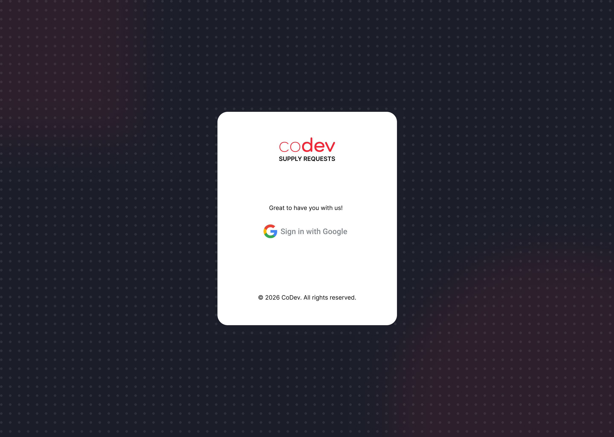

The Google button obtains an ID-token credential and posts it to `/auth/google`. Show an error for `401` invalid credentials or `403` unverified/out-of-domain/deleted accounts. After success, retain the returned user in application state and route according to `role`. On reload, use `/auth/me`; show login when it returns `401`.

```ts
const signedInUser = await apiFetch<SessionUser>('/auth/google', {
  method: 'POST',
  body: { credential: googleIdToken },
});
// Route using signedInUser.role; the API sets the session cookie.

const restoredUser = await apiFetch<SessionUser>('/auth/me');
```

### Catalog, Specs, And Request List

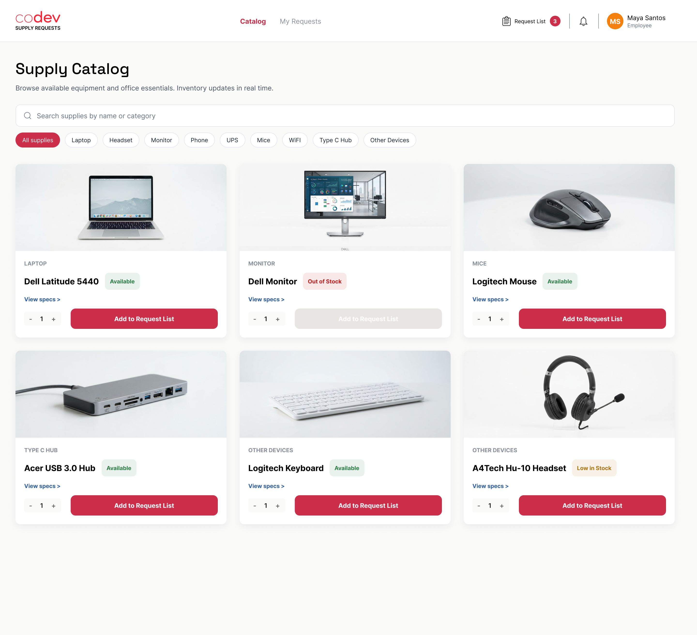

Search/filter with `GET /assets`; pass `search`, exact `category`, and optionally the current user's `location`. Omit category for All. Use `data`, pagination metadata, `quantity`, and `lowQtyAlert` to render cards, filters, stock states, and limits. For View Specs, call `GET /assets/:id` and show non-null specs and image; keep the catalog row's location-scoped quantity if the list was filtered by location.

```ts
const catalogParams = new URLSearchParams({ page: '1', limit: '12' });
if (search.trim()) catalogParams.set('search', search.trim());
if (category) catalogParams.set('category', category);
if (currentUser.location) catalogParams.set('location', currentUser.location);
const catalogPage = await apiFetch(`/assets?${catalogParams}`);
```

The request list is client-side state; there is no cart/draft endpoint. Store one line per asset ID, allow quantity/removal operations locally, and derive the header count from that list. Submit it using the request payload above. Clear local state only after `POST /requests` succeeds.

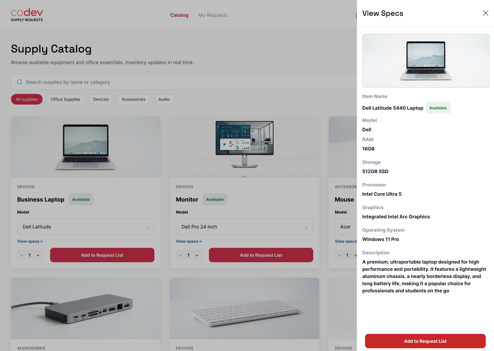

```ts
const assetDetails = await apiFetch(`/assets/${assetId}`);
```

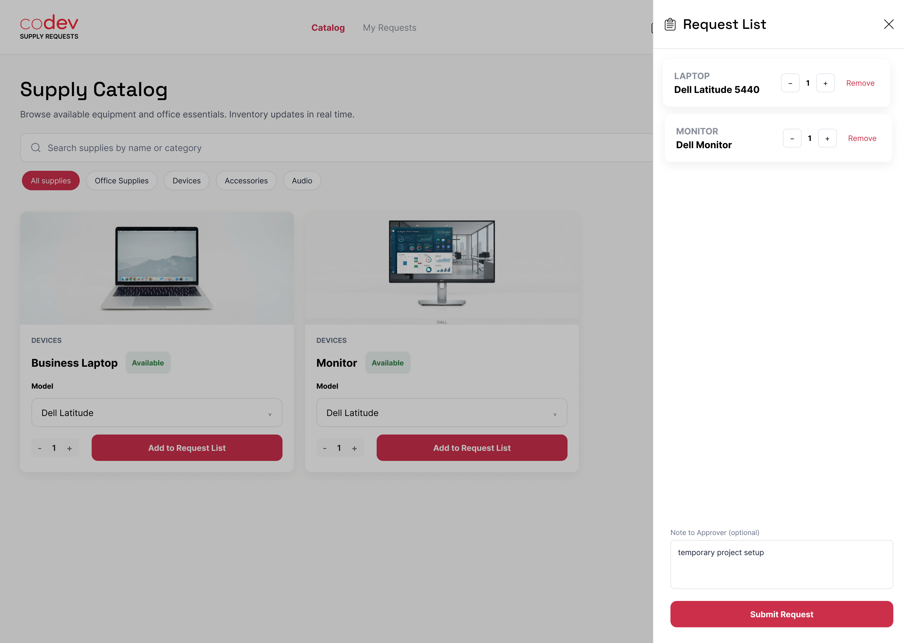

```ts
const submittedRequest = await apiFetch('/requests', {
  method: 'POST',
  body: {
    purpose: approverNote || undefined,
    items: requestItems.map(({ assetId, quantity }) => ({ assetId, quantity })),
  },
});
```

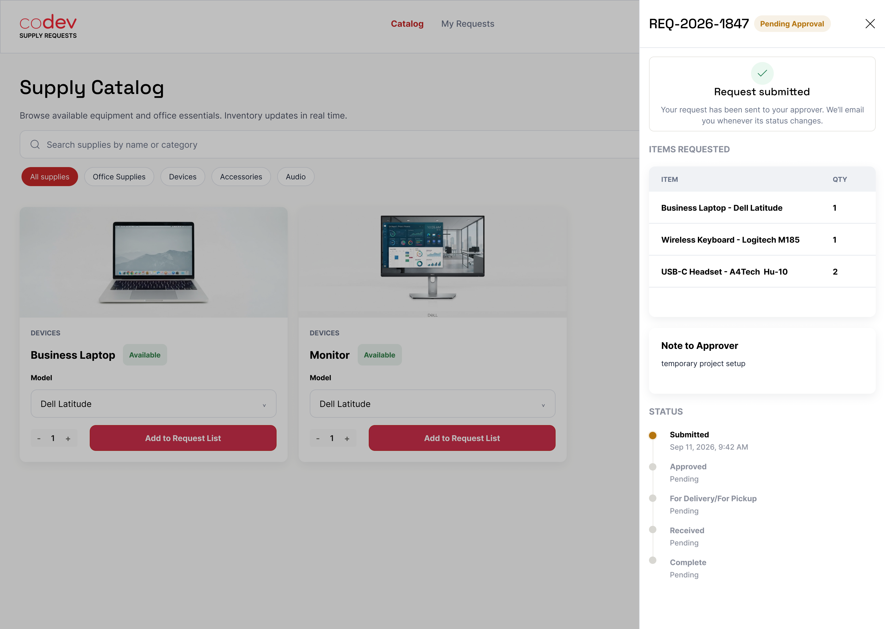

The confirmation uses the POST response: `displayId`, `status`, `createdAt`, `items[].asset`, `items[].quantity`, `purpose`, and `timeline`. Store numeric `id` for later detail fetches; `/requests/:id` does not accept `displayId`. For stock errors, keep the drawer open and let the employee adjust quantities. To reload the panel later:

```ts
const requestDetails = await apiFetch(`/requests/${requestId}`);
```

### My Requests And View Request

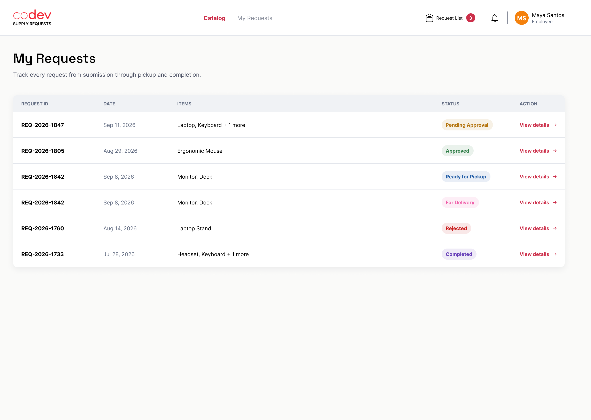

Call `GET /auth/me`, then `GET /requests?requesterId=<user.id>&sort=newest&page=1&limit=10` with credentials. Optional filters are `status`, `displayId`, and `itemName`. Render `displayId`, status, `createdAt`, item asset names/models/quantities, purpose, and rejection reason; use pagination metadata. Open a row with `GET /requests/:id` using the numeric ID. Detail data includes requester, lines, current available stock, review information, purpose, rejection reason, and recorded timeline.

```ts
const currentUser = await apiFetch<SessionUser>('/auth/me');
const requestParams = new URLSearchParams({
  requesterId: String(currentUser.id),
  page: String(page),
  limit: '10',
  sort: 'newest',
});
if (statusFilter) requestParams.set('status', statusFilter);
const myRequests = await apiFetch(`/requests?${requestParams}`);
```

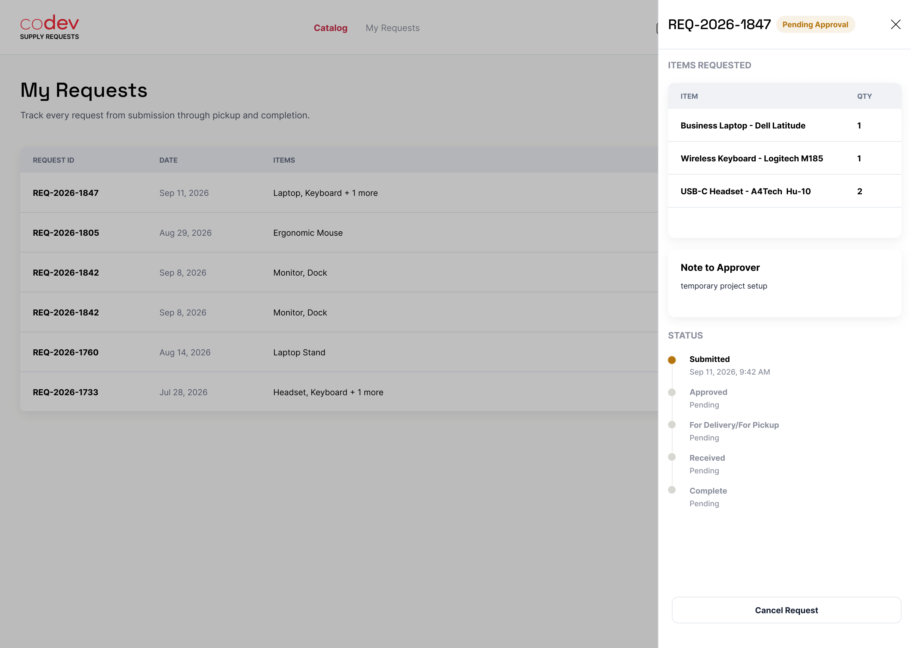

```ts
const requestDetails = await apiFetch(`/requests/${requestId}`);
```

Other supplied detail states: [received](docs/screens/employee-view/my-requests-screen-view-request-received.png), [cancelled](docs/screens/employee-view/my-requests-screen-view-request-cancelled.png), [cancel attempt while pending](docs/screens/employee-view/my-requests-screen-view-request-pending-approval-cancel-attempt.png), and [accountability form](docs/screens/employee-view/my-requests-screen-view-request-accountability-form.png).

**Important backend gaps:** `requesterId` is only a query filter, not an ownership check. Employees can omit it or query another user's ID; `GET /requests/:id` also does not check ownership. This must be fixed server-side before My Requests can be considered private. There is no employee cancellation endpoint or `cancelled` status. `DELETE /requests/:id` is admin-only soft deletion and is not cancellation. The accountability form also has no API endpoint or payload.

Status mapping: `pending_approval` -> Pending Approval; `approved` -> Approved; `ready_for_pickup` -> Ready for Pickup; `for_delivery` -> For Delivery; `rejected` -> Rejected; `completed` -> Complete. The UI's separate Received milestone has no corresponding API status; only `completed` exists as the final state. Timeline shows recorded events, not future milestones.

### Profile

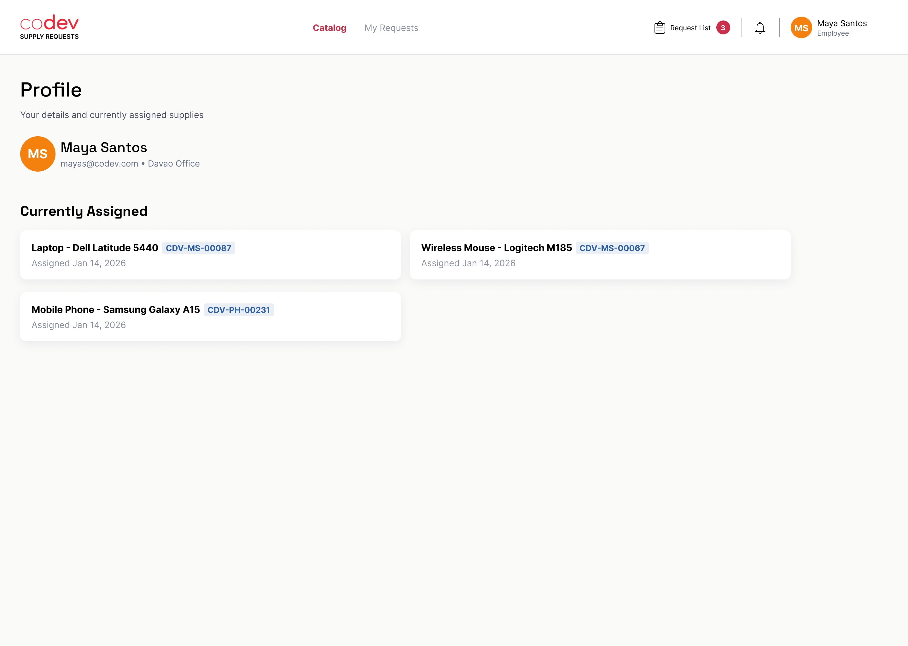

Use `GET /auth/me` for the signed-in employee's identity, avatar, role, and office. No self-service profile update endpoint exists. `/users/:id` mutations are admin-only; do not send employee profile edits there.

```ts
const profile = await apiFetch<SessionUser>('/auth/me');
const assignedItems = await apiFetch(
  `/inventory-items?assignedToId=${profile.id}`,
);
```

## Admin Screens


Admin login uses the same Google flow. The API assigns `admin` to configured `ADMIN_EMAILS`; all admin functions require an admin session. A user with an employee role receives `403` on admin routes.

### Asset Catalog Management

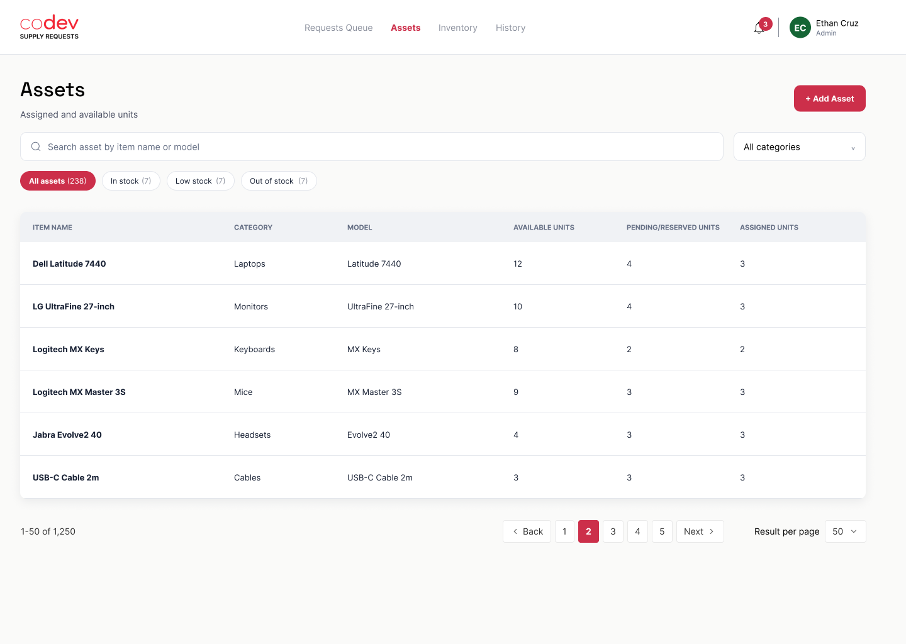

Use `GET /assets` for the paginated list and its search/category/location/stock filters. `POST /assets` creates a catalog definition only; `PATCH /assets/:id` updates it; `DELETE /assets/:id` fails with `409` while any inventory unit references the asset. Quantity is derived from inventory and cannot be changed via asset updates.

```ts
const assetParams = new URLSearchParams({ page: '1', limit: '10', search: 'Laptop' });
const assetPage = await apiFetch(`/assets?${assetParams}`);
```

Create requires `name`, `category`, and `model`; optional fields are `description`, `imageBase64`, `ram`, `processor`, `graphics`, `operatingSystem`, `storage`, and `lowQtyAlert` (defaults to 5; minimum 0). Update is partial; send `null` to clear nullable image/specification fields. The category-specific forms do not imply separate API routes.

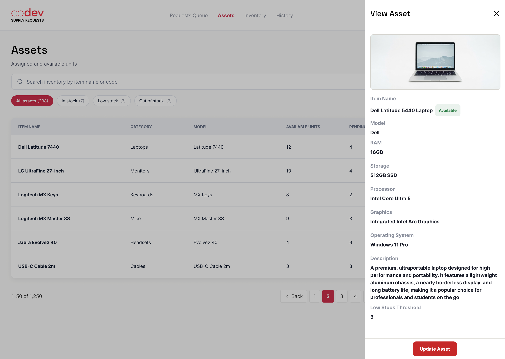

```ts
const asset = await apiFetch(`/assets/${assetId}`);
```

Asset form variants: [Laptop](docs/screens/admin-view/assets-screen-add-asset-laptop.png), [Headset](docs/screens/admin-view/assets-screen-add-asset-headset.png), [Mice](docs/screens/admin-view/assets-screen-add-asset-mice.png), [Other Device](docs/screens/admin-view/assets-screen-add-asset-other-device.png), [Phone](docs/screens/admin-view/assets-screen-add-asset-phone.png), [Type-C Hub](docs/screens/admin-view/assets-screen-add-asset-type-c-hub.png), [UPS](docs/screens/admin-view/assets-screen-add-asset-ups.png), and [WiFi](docs/screens/admin-view/assets-screen-add-asset-wifi.png). The update form is [here](docs/screens/admin-view/assets-screen-update-asset.png).

```ts
const createdAsset = await apiFetch('/assets', {
  method: 'POST',
  body: {
    name: 'Business Laptop',
    category: 'Laptop',
    model: 'Dell Latitude 5440',
    description: '14-inch business laptop',
    ram: '16GB',
    processor: 'Intel Core i7-1355U',
    graphics: 'Intel Iris Xe Graphics',
    operatingSystem: 'Windows 11 Pro',
    storage: '512GB SSD',
    lowQtyAlert: 5,
  },
});

const updatedAsset = await apiFetch(`/assets/${assetId}`, {
  method: 'PATCH',
  body: { lowQtyAlert: 4, description: null },
});

await apiFetch(`/assets/${assetId}`, { method: 'DELETE' });
```

### Inventory Management

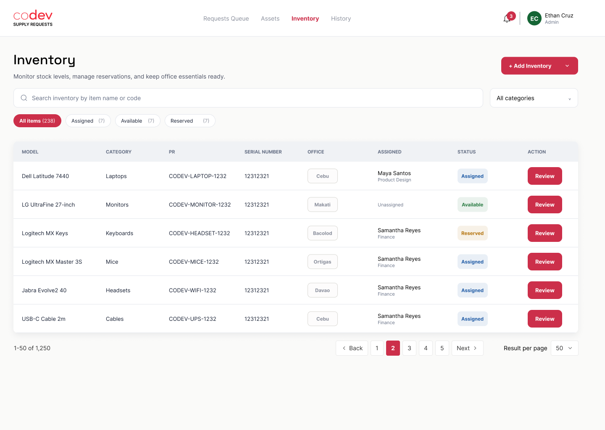

Load and filter with `GET /inventory-items`. Add one unit with `POST /inventory-items`; add a 1-100 unit batch with `POST /inventory-items/bulk`. Map catalog selection to `assetId`, office to `location`, and purchase/identifier/assignment fields to the create DTO. The unit endpoint returns the related asset and actual lifecycle status.

```ts
const inventoryParams = new URLSearchParams({
  page: '1', limit: '10', search: 'Latitude', status: 'Available',
});
const inventoryPage = await apiFetch(`/inventory-items?${inventoryParams}`);
```

For edits, call `PATCH /inventory-items/:id`; omit unchanged fields. `assignedToId: null` unassigns and returns the unit to Available. The users directory (`GET /users`, admin-only) supplies assignable users. For removal, use `DELETE /inventory-items/:id` only after the screen's confirmation; this is a permanent unit deletion.

```ts
const unit = await apiFetch(`/inventory-items/${inventoryItemId}`);
const assignableUsers = await apiFetch('/users');

const createdUnit = await apiFetch('/inventory-items', {
  method: 'POST',
  body: {
    assetId: 1,
    location: 'Cebu',
    serialNumber: 'PF3ABCXY',
    price: 1299.99,
    supplier: 'Example Supplier',
    purchasedAt: '2026-01-15T00:00:00.000Z',
  },
});

const createdUnits = await apiFetch('/inventory-items/bulk', {
  method: 'POST',
  body: {
    assetId: 1,
    location: 'Cebu',
    supplier: 'Example Supplier',
    units: [{ serialNumber: 'PF3ABCXY' }, { serialNumber: 'PF3ABCDZ' }],
  },
});

const updatedUnit = await apiFetch(`/inventory-items/${inventoryItemId}`, {
  method: 'PATCH',
  body: { assignedToId: null, location: 'Makati' },
});

await apiFetch(`/inventory-items/${inventoryItemId}`, { method: 'DELETE' });
```

Inventory screen variants: [add menu](docs/screens/admin-view/inventory-screen-add-inventory-dropdown.png), [single unit](docs/screens/admin-view/inventory-screen-add-single-unit.png), [single unit with catalog selected](docs/screens/admin-view/inventory-screen-add-single-unit-catalog-selected.png), [bulk add](docs/screens/admin-view/inventory-screen-bulk-add-units.png), [review/edit available](docs/screens/admin-view/inventory-screen-review-or-edit-available.png), [review/edit assigned](docs/screens/admin-view/inventory-screen-review-or-edit-assigned.png), [delete](docs/screens/admin-view/inventory-screen-delete-unit.png), and [delete confirmation](docs/screens/admin-view/inventory-screen-delete-unit-confirmation.png).

### Request Queue And Review

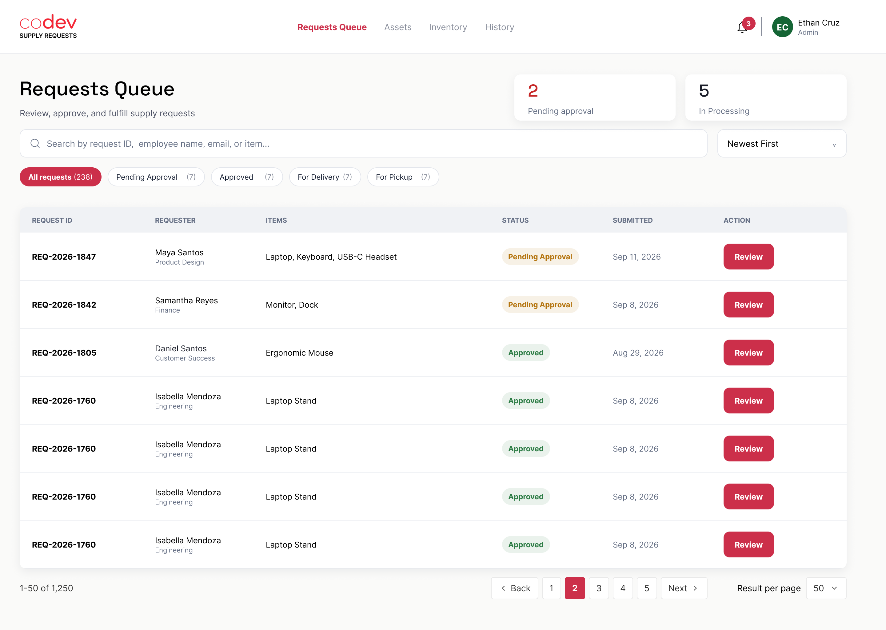

Use `GET /requests` with pagination and any combination of `status`, `displayId`, `requester`, `requesterId`, and `itemName`. Sort by `newest`, `oldest`, or `employee_name_asc`. Open a request with `GET /requests/:id` and use `PATCH /requests/:id` for admin actions. Do not call the update endpoint for employee actions.

```ts
const queueParams = new URLSearchParams({
  page: '1', limit: '10', sort: 'newest', status: 'pending_approval',
});
const queue = await apiFetch(`/requests?${queueParams}`);
const request = await apiFetch(`/requests/${requestId}`);
```

Request review states: [pending approval](docs/screens/admin-view/requests-queue-screen-review-request-pending-approval.png), [approved](docs/screens/admin-view/requests-queue-screen-review-request-approved.png), [rejected](docs/screens/admin-view/requests-queue-screen-review-request-rejected.png), and [for delivery](docs/screens/admin-view/requests-queue-screen-review-request-for-delivery.png). The sort menu is [shown here](docs/screens/admin-view/requests-queue-screen-sort-menu.png); invalid delivery and rejection attempts are [here](docs/screens/admin-view/requests-queue-screen-review-request-for-delivery-attempt.png) and [here](docs/screens/admin-view/requests-queue-screen-review-request-reject-attempt.png).

Approve using `{ "status": "approved" }`; reject using `{ "status": "rejected", "rejectionReason": "..." }`; then advance approved requests to `ready_for_pickup` or `for_delivery`, and finally to `completed`. A rejection reason is required. The API controls transitions and reservation changes; display `409` conflicts from stale/invalid actions and refresh request detail. Requested line items and quantities are immutable after submission.

```ts
await apiFetch(`/requests/${requestId}`, {
  method: 'PATCH', body: { status: 'approved' },
});
await apiFetch(`/requests/${requestId}`, {
  method: 'PATCH', body: { status: 'rejected', rejectionReason: 'Duplicate request' },
});
await apiFetch(`/requests/${requestId}`, {
  method: 'PATCH', body: { status: 'ready_for_pickup' },
});
await apiFetch(`/requests/${requestId}`, {
  method: 'PATCH', body: { status: 'for_delivery' },
});
await apiFetch(`/requests/${requestId}`, {
  method: 'PATCH', body: { status: 'completed' },
});
```

### Request History

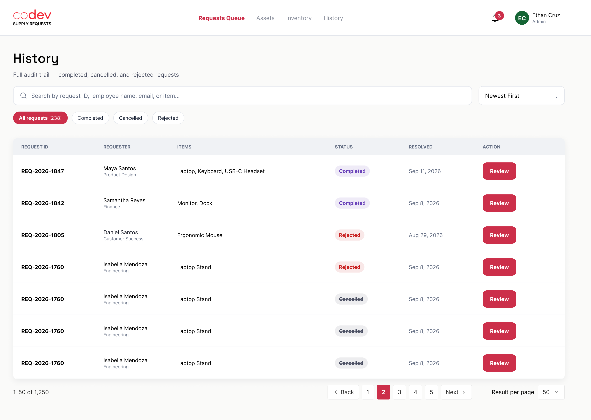

There is no dedicated history endpoint today. As a limited workaround, reuse `GET /requests` with status/search/sort filters and pagination, and `GET /requests/:id` for a record's detail. The [history item view](docs/screens/admin-view/history-screen-view-history-item.png) maps to request detail and its `timeline`. This does not provide a general audit/history feed or include soft-deleted requests.

To soft-delete a request from an authorized admin workflow, require explicit confirmation, then call:

```ts
await apiFetch(`/requests/${requestId}`, { method: 'DELETE' });
```

### User Directory And Assignment

There is no user-management screenshot, but the API exposes admin-only `/users` routes. Use `GET /users` to populate assignment and requester references. `POST /users` requires email, first/last name, avatar URL, role, and location; `PATCH /users/:id` updates first/last name, avatar, role, or location. `DELETE /users/:id` deletes an account. Locations are `Cebu`, `Bacolod`, `Makati`, `Ortigas`, and `Davao`; roles are `employee` and `admin`.

```ts
const users = await apiFetch('/users');
const userRecord = await apiFetch(`/users/${userId}`);

const createdUser = await apiFetch('/users', {
  method: 'POST',
  body: {
    email: 'ada@example.com',
    firstName: 'Ada',
    lastName: 'Lovelace',
    avatarUrl: 'https://example.com/ada.png',
    role: 'employee',
    location: 'Cebu',
  },
});

const updatedUser = await apiFetch(`/users/${userId}`, {
  method: 'PATCH',
  body: { role: 'admin', location: 'Makati' },
});

await apiFetch(`/users/${userId}`, { method: 'DELETE' });
```

## Email Designs And API Triggers

Email assets are references for messages the backend sends automatically; there are no frontend email or notification endpoints. Submission sends a confirmation to the requester and an approval-needed email to admins. Admin status changes send the matching requester email. Delivery is best-effort and does not roll back a saved request.

| Trigger | Email design |
| --- | --- |
| New account created on Google sign-in | [Welcome](docs/screens/employee-view/email-welcome.png) |
| Request submitted | [Pending approval confirmation](docs/screens/employee-view/email-request-pending-approval.png) |
| Request submitted, admin notification | [Admin approval needed](docs/screens/admin-view/email-request-pending-approval.png) |
| Admin approves | [Approved](docs/screens/employee-view/email-request-approved.png) |
| Admin rejects | [Rejected](docs/screens/employee-view/email-request-rejected.png) |
| Admin sets `ready_for_pickup` | [Ready for pickup](docs/screens/employee-view/email-request-ready-for-pickup.png) |
| Admin sets `for_delivery` | [For delivery](docs/screens/employee-view/email-request-for-delivery.png) |
| Admin sets `completed` | [Completed](docs/screens/employee-view/email-request-completed.png) |

The supplied [received email design](docs/screens/employee-view/email-request-received.png) has no separate `received` status or trigger in the current API. The completed email is the backend's final-state notification.

## Missing Screen Integrations

The screens include integrations not supported by current endpoints: a dedicated admin history/audit endpoint, employee request cancellation, an employee accountability/receipt form, a distinct `received` status, notification-bell data, and self-service profile editing. The current `GET /requests` list and request `timeline` are only a limited workaround for the History screen, not a general audit feed. Do not map unsupported actions to unrelated operations such as request rejection or admin soft deletion. These features need explicit backend contracts before frontend wiring. Also resolve request ownership enforcement for employee list/detail routes before exposing private request history.