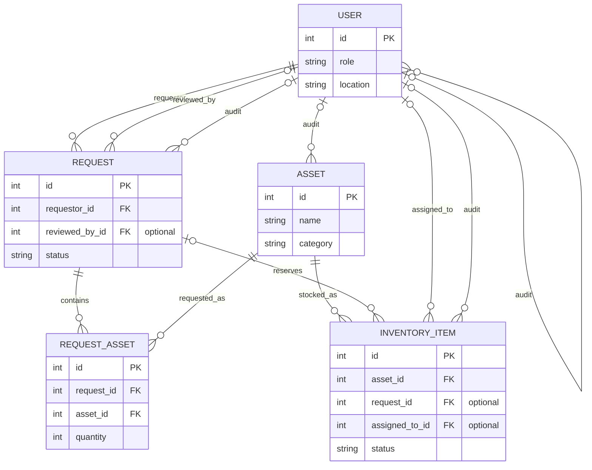

# Architecture

## Application Shape

This is a NestJS modular monolith. `src/app.module.ts` composes the feature modules, `src/main.ts` configures HTTP behavior and Swagger, and TypeORM connects the modules to PostgreSQL. `synchronize` is disabled; schema changes must be made through migrations in `src/migrations/`.

Each feature generally groups its controller, service, DTOs, and TypeORM entities together:

| Area | Responsibility |
| --- | --- |
| `src/auth/` | Google sign-in, session cookie, authentication and role guards |
| `src/users/` | User records, roles, and office locations |
| `src/assets/` | Asset catalog endpoints |
| `src/inventory-items/` | Inventory catalog, including batch creation |
| `src/requests/` | Office-supply request submission, review, and fulfillment |
| `src/mailer/` | Request and account notification email templates and delivery |
| `src/common/` | Shared pagination and problem-details responses |
| `src/config/` | TypeORM configuration and database naming strategy |
| `src/migrations/` | Versioned PostgreSQL schema changes |

Controllers define HTTP routes and authorization metadata. Services contain business operations. DTOs validate and transform request input; the global `ValidationPipe` strips unknown properties. Entities map persistence models and are also used for selected Swagger response schemas.

## API and Authentication

Swagger UI and its OpenAPI document are served at the API root (`/`). Routes are grouped under `/auth`, `/users`, `/assets`, `/inventory-items`, and `/requests`. The API uses a global authentication guard; routes marked public are the exception. Role-protected routes use the `admin` and `employee` roles.

`POST /auth/google` accepts a Google ID credential. The server verifies the credential against `GOOGLE_CLIENT_ID` and restricts sign-in to `GOOGLE_ALLOWED_DOMAIN`. On success, it sets an HTTP-only `session` cookie containing a signed JWT. Use that cookie for subsequent protected requests. `POST /auth/logout` clears it, and `GET /auth/me` returns the signed-in user.

The global validation and exception handling use RFC 9457-style problem details for errors. Swagger documents the request and response contracts; check the controller and DTO when behavior or validation details need clarification.

## Request Lifecycle

Requests include a requester, one or more requested items, a status, and an audit timeline. The status values are `pending_approval`, `approved`, `ready_for_pickup`, `for_delivery`, `rejected`, and `completed`.

Employees and admins can list and retrieve requests and submit requests. Admins perform review and fulfillment updates; rejection requires a reason. Invalid status transitions are rejected with HTTP 409. The exact transition rules live in `src/requests/requests.service.ts` and should be updated alongside any workflow changes.

New users are provisioned when they first sign in. Accounts matching `ADMIN_EMAILS` are assigned the admin role; other allowed company accounts are assigned employee. User records also carry a location from the supported office locations in the user entity.

## Data and Migrations

PostgreSQL is the source of truth. Do not enable TypeORM schema synchronization for local or production work. Create a migration for schema changes, review its generated SQL and rollback behavior, and apply it locally before submitting. The deployment workflow applies production migrations before deploying the API; see [Deployment](../DEPLOYMENT.md).

For endpoint details, use Swagger. For test boundaries and change workflow, see [Contributing](../CONTRIBUTING.md).

## Entity Relationships

Audit relationships represent each entity's optional `createdBy`, `updatedBy`, and `deletedBy` references to `User`.
